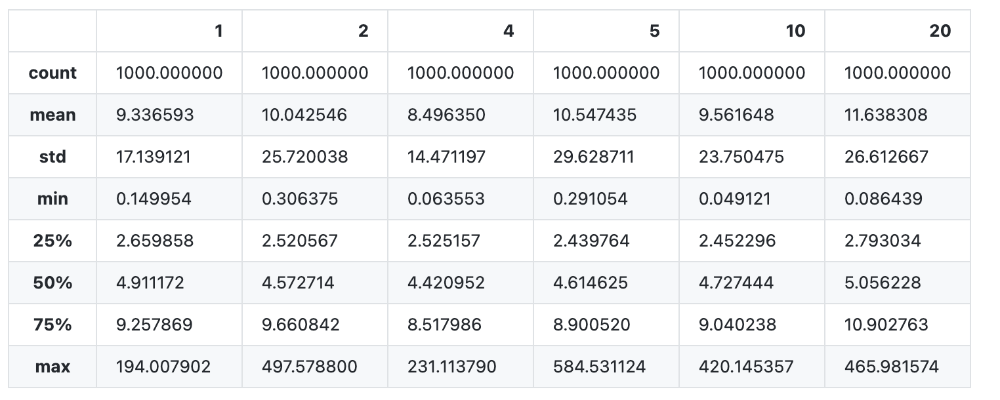
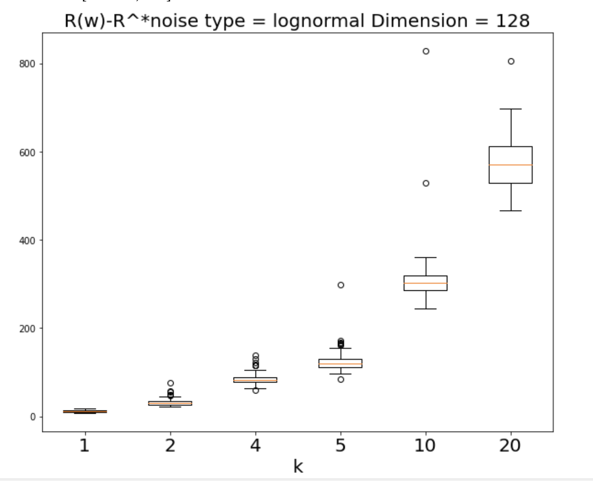

## 実験概要
DC-SGD,RV-SGDAveにて

- サンプル数
- ノイズの強度
- 次元数

の三つの項目をそれぞれで変化をさせて最終的に得られる過剰期待損失の値とそのステップごとの推移を確認した。

過剰期待損失は100回の試行で確認。

推移に関しては一回の試行を表示している。

## 実験結果
詳細な実験結果

- DC-SGD
    - サンプル数
    https://nbviewer.jupyter.org/github/NaokiNakamichi/ML/blob/master/GD/exp/simulation/RVSGD_samplenum_0817.ipynb
    - ノイズの強度
    https://nbviewer.jupyter.org/github/NaokiNakamichi/ML/blob/master/GD/exp/simulation/DCSGD_Noise_0813.ipynb
    - 次元数
    https://nbviewer.jupyter.org/github/NaokiNakamichi/ML/blob/master/GD/exp/simulation/DCSGD_dimension_0816.ipynb

- RV-SGD
    - サンプル数
    https://nbviewer.jupyter.org/github/NaokiNakamichi/ML/blob/master/GD/exp/simulation/RVSGD_samplenum_0817.ipynb
    - ノイズの強度
    https://nbviewer.jupyter.org/github/NaokiNakamichi/ML/blob/master/GD/exp/simulation/RVSGD_Noise_0815.ipynb
    - 次元数
    https://nbviewer.jupyter.org/github/NaokiNakamichi/ML/blob/master/GD/exp/simulation/RVSGD_dimension_0817.ipynb

いくつかの実験結果（列挙しているがそれぞれで比較しているわけではない）
1. DC-SGD ノイズが正規分布,分散が2.4の場合

    - サンプル数 10000
    - 次元数　６

    ノイズが正規分布の場合
    分散が1.5,2.2の場合でも同じように少しだけ小さくなる。

2. DC-SGD ノイズが対数正規分布,分散が1.25の場合
    - サンプル数 10000
    - 次元数　６

ヘビーテイルなノイズでは分割、統合による優位性はみられないように感じた。

3. RV-SGD ノイズが対数正規分布, 分散1.75
    - サンプル数 10000
    - 次元数　128

AveragedSGDが効いているのかサンプル数が足りない場合は分割すると学習が足りなく、また分割しない場合でも学習は安定している。

4. DC-SGD ノイズ対数正規分布, 分散1.75
    - サンプル数 2500
    - 次元数 512

次元数を増やした場合さらに深い学習が必要になりそうで分割した場合に不利になるか

